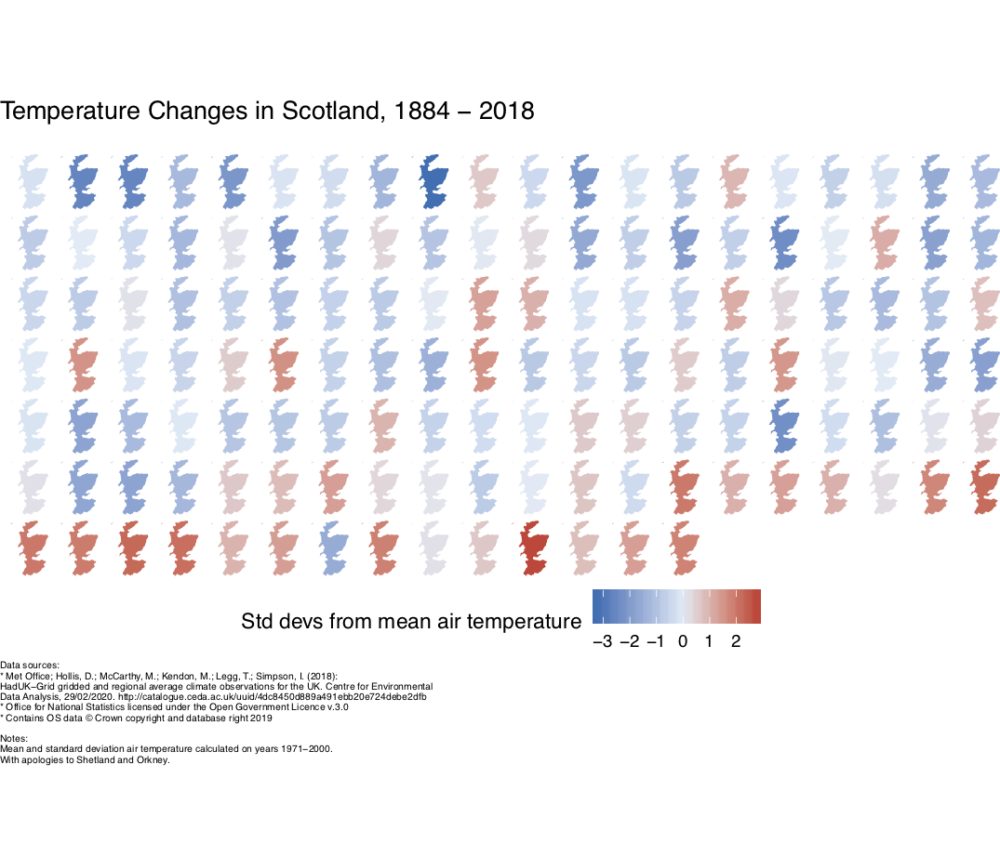

# scotland_temperature
Temperature changes in Scotland, 1884-2018

Visualising the change in mean air temperature in Scotland between 1884 and 2018 using choropleth maps in R. The colour
shows the number of standard deviations the year's mean temperature is away from from a reference temperature (blue for below, so generally cooler, 
and red for above, generally hotter). The reference temperature and standard deviations are calculated on the years spanning 1971-2000.

The code is <b>heavily</b> based on Jan Knappe's
[R-bloggers post](https://www.r-bloggers.com/temperature-changes-in-germany-visualized-in-r/) (the original article can be read [here](https://www.janknappe.com/blog/r-temperature-changes-germany/)) visualising temperature changes 
in Germany. My plot looks almost identical to theirs, and therefore all credit is directed to the original author!

I used climate data downloaded from the [Centre for Envronmental Data Analysis](http://data.ceda.ac.uk/badc/ukmo-hadobs/data/insitu/MOHC/HadOBS/HadUK-Grid/v1.0.0.0/country/tas/ann/v20181126).
The [UK shapefile](http://geoportal1-ons.opendata.arcgis.com/datasets/nuts-level-1-january-2018-ultra-generalised-clipped-boundaries-in-the-united-kingdom) is from the Office for National Statistics Open Geography Portal. 

Things to bear in mind:

* The reference temperature and reference standard deviations are based on years 1971-2000
* The map projection goes a little wonky. I'm not sure why, as it looks fine when plotting only a few years
* I've chopped out Orkney and Shetland, as it resulted in a lot of white space, and the plot didn't look great. Sorry!
* A big difference to this code and the [work referenced above](https://www.r-bloggers.com/temperature-changes-in-germany-visualized-in-r/) is 
I've used average data for all Scotland, rather than gridded data. This data does exist however, and I'd be keen to return
to this. This had been my original intention, but my computer struggled with the file sizes.
* I'm personally not sure about the colour scheme
* Unlike the original work, the colour scale does not saturate at +/- 2.6C. I originally tried this, but using 
`clim = c(-2.6,2.6)` resulted in the few maps outwith this range appearing gray, not the top/bottom red and blue reference
colours.

As I'm in the process of learning R, there are undoubtedly lots of ways this can be improved. 

